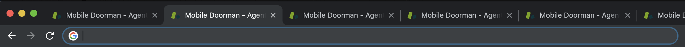
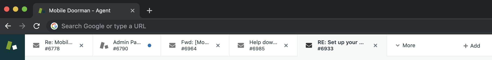

# Zen (desk) Master

* Do you do a lot of zendesking?
* Do you click a lot of Zendesk Links?
* Are you tired of having a zilliong browser tabs with random tickets open?
* Do you like the in-page tabs that zendesk uses?

### If so, this is the Chrome Extension for you!

This extension intercepts page loads to /agent/tickets/1234, and if there is already a zendesk tab open in chrome it will switch you to that existing tab and open up the ticket right there!

Or, for the visual learners:
## Before

## After
